<!-- Generated by GitHub Profile Agent Console. Edit profile.config.json, then run npm run generate. -->

  <picture>
    <source media="(max-width: 760px) and (prefers-color-scheme: dark)" srcset="./assets/hero/agent-console-73b95325-mobile-dark.svg">
    <source media="(max-width: 760px)" srcset="./assets/hero/agent-console-73b95325-mobile-light.svg">
    <source media="(prefers-color-scheme: dark)" srcset="./assets/hero/agent-console-73b95325-dark.svg">
    <source media="(prefers-color-scheme: light)" srcset="./assets/hero/agent-console-73b95325-light.svg">
    
  </picture>

  

## About Me

I build AI agent systems that connect real tools and data to natural conversation - from WhatsApp-based automation platforms to MCP servers that give LLM clients live access to external data.

My recent work spans a WhatsApp-based automation platform for Kapanlagi Youniverse and an MCP server that gives AI clients live access to Indonesian news feeds.

## Current Focus

| Area | What I am exploring |
| --- | --- |
| **AI Agents** | Building reliable agent workflows that connect LLMs to real tools and data. |
| **MCP Servers** | Designing Model Context Protocol servers that expose external data and tools to LLM clients. |
| **Automation** | Turning natural conversation into automated actions across business systems. |

## Featured Work

| Project | Focus | Why it matters |
| --- | --- | --- |
| [**KLY Automation**](https://github.com/ndollem/kly-ai-automation-platform) | WhatsApp AI automation for internal teams | WhatsApp-based AI automation platform for Kapanlagi Youniverse, built on the open-source Hermes Agent orchestrator with MCP connectors, business-use-case agents, and proactive intelligence alerts. |
| [**RSS MCP Server**](https://github.com/ndollem/mcp-rss) | MCP server for Indonesian news feeds | HTTP-based MCP server in Python/FastAPI that serves ten Indonesian news RSS feeds as tools for MCP clients like Hermes CLI and Cursor, deployable to Vercel as a serverless function. |

## Research Direction

I focus on connecting large language models to real systems through the Model Context Protocol and agent orchestration layers like Hermes - building tools, data connectors, and automations that let agents act reliably inside real business workflows.

## Tech Stack

`Python` · `FastAPI` · `Node.js` · `MCP` · `WhatsApp API` · `Vercel` · `Pytest`

## Recent Activity

<!-- AUTO:ACTIVITY:START -->
- Jul 20, 2026: pushed 1 commit to [venturo-id/venturo-claude](https://github.com/venturo-id/venturo-claude).
- Jul 20, 2026: merged pull request [#11](https://github.com/venturo-id/venturo-claude) in [venturo-id/venturo-claude](https://github.com/venturo-id/venturo-claude).
- Jul 20, 2026: opened pull request [#11](https://github.com/venturo-id/venturo-claude) in [venturo-id/venturo-claude](https://github.com/venturo-id/venturo-claude).
- Jul 20, 2026: created a branch in [venturo-id/venturo-claude](https://github.com/venturo-id/venturo-claude).
- Jul 19, 2026: created a branch in [ndollem/survey-app](https://github.com/ndollem/survey-app).
- Jul 18, 2026: merged pull request [#10](https://github.com/venturo-id/venturo-claude) in [venturo-id/venturo-claude](https://github.com/venturo-id/venturo-claude).
<!-- AUTO:ACTIVITY:END -->

---

  Building agents that connect language models to the real world.

